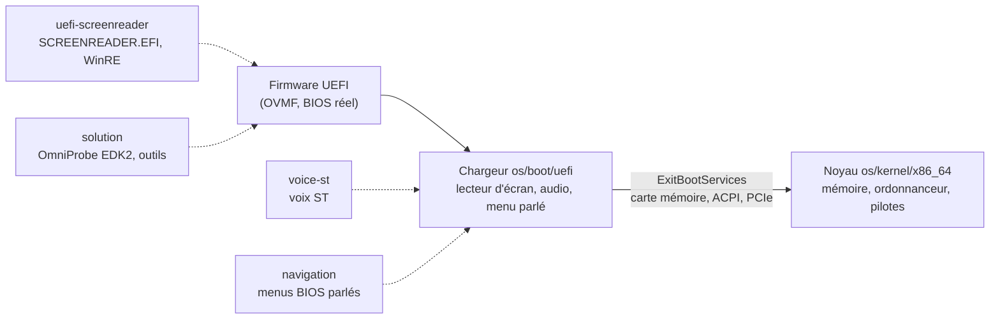

# omni-os

[](https://github.com/ejjjkkjlkkj/omni-os/actions/workflows/ci.yml)
[](https://github.com/ejjjkkjlkkj/omni-os/actions/workflows/integrity-daily.yml)

**Un ordinateur accessible dès l'allumage.** omni-os fait parler la machine avant tout
système d'exploitation : menus du BIOS/UEFI lus à voix haute et navigables au clavier,
puis un chargeur et un noyau x86-64 écrits en Rust, avec leur propre voix de synthèse.

- **Lecteur d'écran UEFI** : lit les menus et réglages du firmware (HII), le menu de
  démarrage et l'environnement de récupération Windows.
- **Audio natif** : pilotes HDA, USB audio et virtio-snd dans le chargeur, sans l'aide
  du système d'exploitation.
- **Noyau Rust** : pagination W^X, tas, ring 3 et appels système, ordonnanceur préemptif,
  APIC/IOAPIC, PCI Express, NVMe, AHCI, xHCI/USB HID, ACPI.
- **Voix ST** : synthèse formantique déterministe en français et en anglais, sans GPU
  ni réseau, utilisable dans WinPE/WinRE.
- **Prouvé en continu** : chaque changement est compilé, testé et **démarré dans QEMU**.

## Comment ça démarre



## Démarrage rapide

Prérequis : [rustup](https://rustup.rs) (la version de Rust est épinglée par les fichiers
`rust-toolchain.toml`), Python 3.13, et pour le démarrage QEMU avec firmware OVMF/edk2.

```bash
# Démarrer le chargeur et le noyau dans QEMU, puis vérifier les preuves
tools/boot/run-qemu.sh
```

```bash
# Tests de l'OS (bibliothèques du noyau)
cd os && cargo test --locked --workspace
```

```bash
# Faire parler la voix ST
cd voice-st && cargo run --release -- -l fr -t "Bonjour, le menu est ouvert." -o bonjour.wav
```

```bash
# Tests du firmware et des outils (depuis solution/)
cd solution && PYTHONPATH=src python -m unittest discover -s tests
```

## Organisation

| Dossier | Contenu |
|---|---|
| [`os/`](os/) | chargeur UEFI (`boot/uefi`), noyau (`kernel/x86_64`), bibliothèques `aw-*`, documentation d'architecture ([`os/docs/`](os/docs/)) |
| [`uefi-screenreader/`](uefi-screenreader/) | lecteur d'écran UEFI et WinRE, étapes de construction et preuves matérielles |
| [`solution/`](solution/) | paquet EDK2 `OmniPkg` (OmniProbe : audio HDA, preuves physiques), outils, données de sécurité |
| [`navigation/`](navigation/) | navigation parlée des menus du BIOS (IFR), voix v4/v5 |
| [`voice-st/`](voice-st/) | moteur de voix ST (Rust), ABI C, intégration SAPI5 |
| [`tools/`](tools/) | démarrage QEMU, contrôle d'intégrité, sauvegarde |
| [`salvage/`](salvage/) | travail non commité récupéré des anciens clones, gardé tel quel |
| [`docs/`](docs/) | [chaîne de démarrage](docs/BOOT-CHAIN.md), [capacités UEFI et feuille de route](docs/UEFI-CAPABILITIES.md), [référentiels NIST et SLSA](docs/SECURITY-FRAMEWORK.md), [provenance](docs/PROVENANCE.md), [index des archives](docs/ARCHIVE.md) |

## Qualité

Chaque push et chaque pull request passe par la CI `omni-os CI` :

| Job | Ce qui est prouvé |
|---|---|
| `integrity` | provenance des 5 composants, 74 archives intactes, aucun secret, aucun fichier > 50 Mio |
| `os` | rustfmt + clippy `-D warnings` (workspace, UEFI, noyau), tests, builds UEFI et noyau, lockfiles inchangés |
| `boot` | **démarrage réel dans QEMU** (q35 + OVMF, NVMe/xHCI, HDA avec codec) : voix du chargeur et du noyau réellement jouées, chargeur, autotest du lecteur d'écran, passage au noyau, pagination, PCI, ordonnanceur, préemption (si timer), idle ; échec sur toute panique ou exception |
| `navigation-boot` | `NAVIGATION.EFI` démarré dans QEMU avec un codec HDA : navigation F1/Bas/Haut/Échap, parole interrompue en temps réel, audio capturé **identique au bit près** à la référence |
| `voice-st` | rustfmt + clippy `-D warnings`, 39 tests, moteur SAPI5 et son harness COM, test de l'ABI C compilé avec MSVC `/W4 /WX` (Windows, cible WinPE/WinRE) |
| `c` | protocole de `solution` et cœur sémantique de `navigation` avec gcc et clang `-Werror`, ASan/UBSan, analyseur statique clang |
| `solution` | 278 tests, plus 37 tests `.omni-agent` |
| `navigation` | 5 contrats de navigation et de voix UEFI |

`integrity daily` revérifie chaque jour les archives et la provenance.
La même vérification de démarrage sert en local et en CI : [`tools/boot/check-log.sh`](tools/boot/check-log.sh).

## Sécurité

Confidentialité, intégrité et disponibilité : voir [SECURITY.md](SECURITY.md). Positionnement face
aux NIST SP 800-193, 800-147, 800-155, 800-218 et à SLSA : [docs/SECURITY-FRAMEWORK.md](docs/SECURITY-FRAMEWORK.md).
Chaque version publiée porte des empreintes SHA-256 et une attestation de provenance signée.
Les failles se signalent en privé (onglet *Security*, puis *Report a vulnerability*).

## Licence

Le code d'omni-os est sous licence [0BSD](LICENSE) : utilisation, copie, modification et
distribution libres, avec ou sans contrepartie, sans condition. Les composants tiers gardent
leur propre licence ; en particulier, le backend neuronal **optionnel** de la voix s'appuie
sur des outils GPL-3.0 (voir [`voice-st/LICENSE-THIRD-PARTY.md`](voice-st/LICENSE-THIRD-PARTY.md)).

## Historique

omni-os réunit, avec tout leur historique, les dépôts `accessible-windows`, `solution`,
`project` et `st`. Aucun travail n'a été perdu : toutes les branches non fusionnées sont
conservées en lecture seule sous `archive/*`. Détails dans [docs/PROVENANCE.md](docs/PROVENANCE.md).
