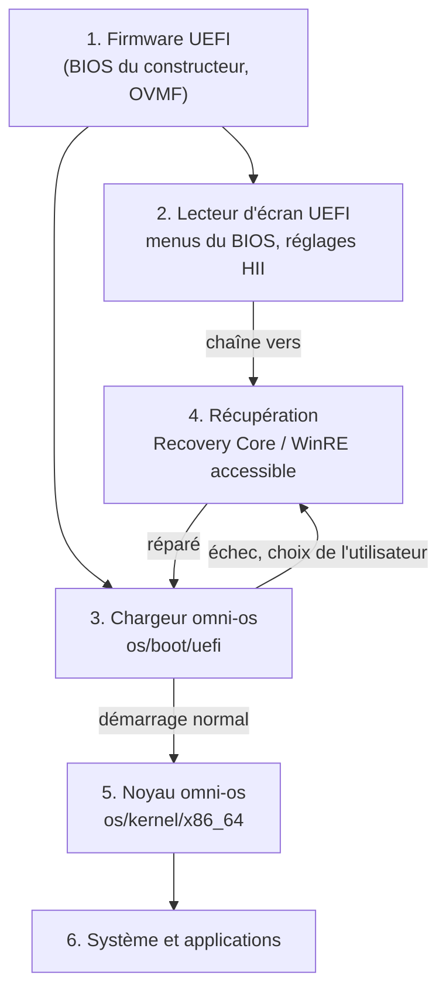

# La chaîne complète, de l'allumage au système

Règle unique : **à chaque étape, une personne aveugle peut entendre où elle en est et agir
au clavier**. Aucune étape ne suppose que l'étape suivante réussira.

| Étape | Composant | Ce que l'utilisateur entend et peut faire | État |
|---|---|---|---|
| 1. Firmware | BIOS réel ou OVMF | rien par lui-même : c'est pourquoi les étapes 2 et 3 existent | hors d'omni-os |
| 2. Réglages du BIOS | [`uefi-screenreader`](../uefi-screenreader/) (`SCREENREADER.EFI`), [`navigation`](../navigation/) (`NAVIGATION.EFI`) | tous les menus et réglages HII lus à voix haute, navigation F1/flèches/Échap, parole interrompue en temps réel | fait ; prouvé dans QEMU avec codec HDA (`navigation-boot`) et sur ASUS M1603QA / AMD 5800H |
| 3. Chargeur | [`os/boot/uefi`](../os/boot/uefi/) | menu de démarrage parlé, Setup parlé à onglets, état matériel et sécurité (TPM, Secure Boot), braille, audio HDA/AC'97/virtio/USB/haut-parleur | fait ; prouvé à chaque changement (`boot`) |
| 4. Récupération | [`uefi-screenreader/boot/winre-accessible-v1`](../uefi-screenreader/boot/winre-accessible-v1), Recovery Core ([`os/docs/RECOVERY-BOOT-ARCHITECTURE.md`](../os/docs/RECOVERY-BOOT-ARCHITECTURE.md)) | **Recovery Core natif** dans le chargeur ([`os/boot/uefi/src/recovery.rs`](../os/boot/uefi/src/recovery.rs)) : état de démarrage redondant, noyau vérifié par SHA-256, essai borné avec retour automatique, menu parlé au clavier (réessayer, revenir au dernier système, diagnostic, arrêt confirmé) ; WinRE accessible en complément | Recovery Core : fait et prouvé à chaque changement (`recovery`), y compris la promotion d'une génération par le bilan de santé du noyau et la réinstallation vérifiée depuis une clé USB |
| 5. Noyau | [`os/kernel/x86_64`](../os/kernel/x86_64/) | menu de démarrage parlé (pilote HDA du noyau), lecteur d'écran, braille, console texte ; clavier PS/2 et USB HID | fait ; voix du noyau prouvée à chaque changement (`boot`, `AW_HDA_SPEECH_PROOF_OK`) |
| 6. Système | [`os/docs/ROADMAP.md`](../os/docs/ROADMAP.md), phases 4 à 7 | — | à faire |

## Cohérence entre les étapes

- **Une seule voix, la nôtre** : tout ce qui parle est produit par omni-os. Les clips
  pré-enregistrés du chargeur, du noyau et de `NAV.BIN` sont rendus par la voix ST
  ([`voice-st`](../voice-st/), [`tools/voice/gen-firmware-speech.py`](../tools/voice/gen-firmware-speech.py)),
  la navigation par VoiceCore, et le texte dynamique par le synthétiseur formantique du
  chargeur (`os/boot/uefi/src/synth.rs`). Aucune voix de Microsoft ni d'un autre éditeur.
- **Un seul journal de preuves** : chaque étape écrit des marqueurs `AW_*` ou `HII_GRAPH_*`
  vérifiés par la CI ([`tools/boot/check-log.sh`](../tools/boot/check-log.sh),
  [`tools/boot/navigation-qemu.sh`](../tools/boot/navigation-qemu.sh)).
- **Même clavier partout** : Tab/flèches/Entrée/Échap, F1 pour l'aide, Espace pour répéter.
- **Sécurité continue** : l'état Secure Boot / TPM est lu et annoncé dès l'étape 3 ; ce qui
  touche au réseau suit [UEFI-CAPABILITIES.md](UEFI-CAPABILITIES.md) (réseau optionnel,
  authentifié, jamais nécessaire pour réparer localement).

## Ce qui manque pour une chaîne complète

1. **Remédiation signée par le réseau** (règle 9 de
   [`RECOVERY-BOOT-ARCHITECTURE.md`](../os/docs/RECOVERY-BOOT-ARCHITECTURE.md)) : le DHCP sur
   demande est fait ; restent HTTPS et le manifeste signé.
2. **Signature d'éditeur sur les images** : la réinstallation et la promotion sont faites et
   prouvées ; l'image réinstallée est aujourd'hui reconnue par son empreinte enregistrée, pas
   encore par une signature d'éditeur.
3. **Système installable** (étape 6), avec la même voix et le même clavier.
